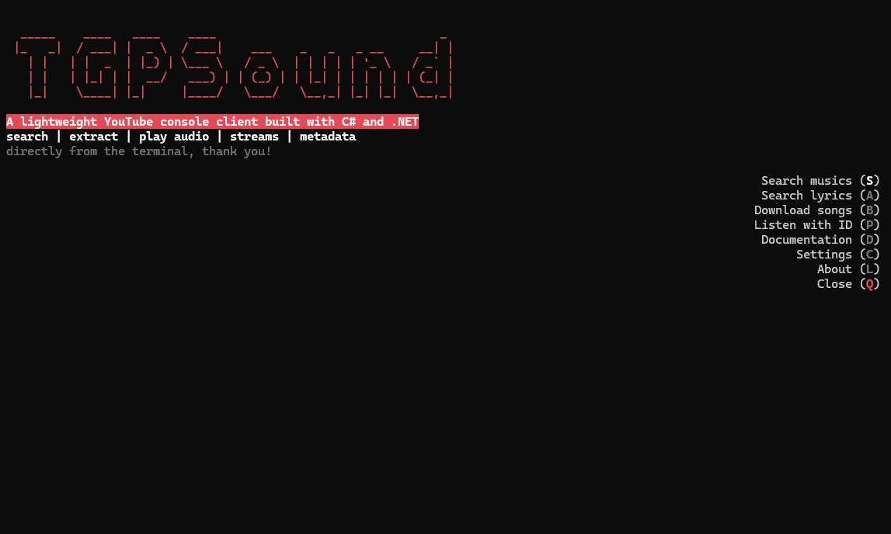
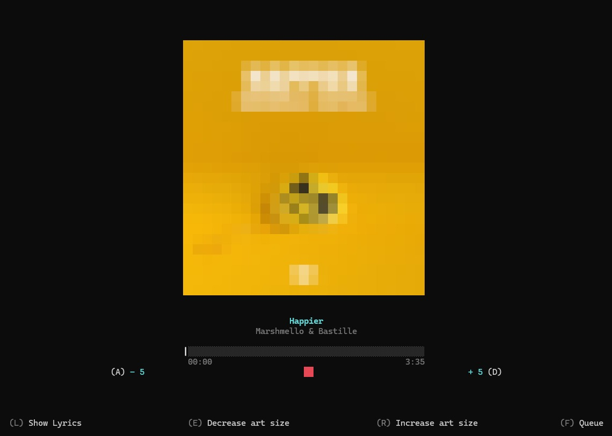
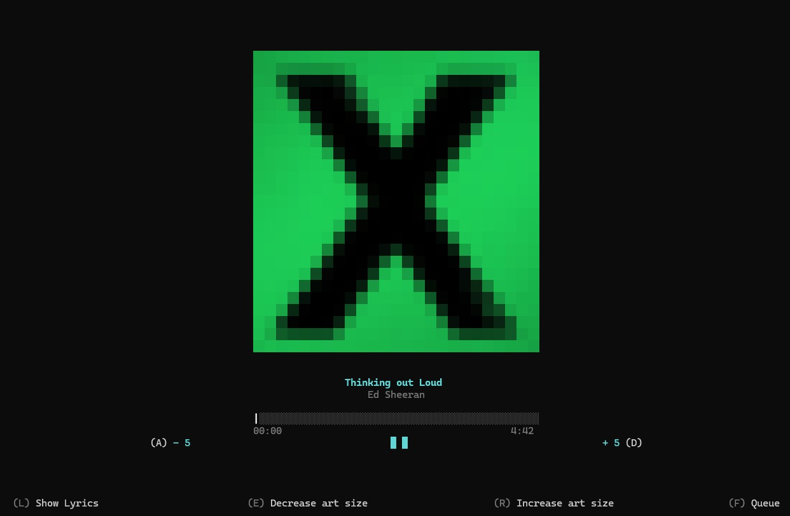
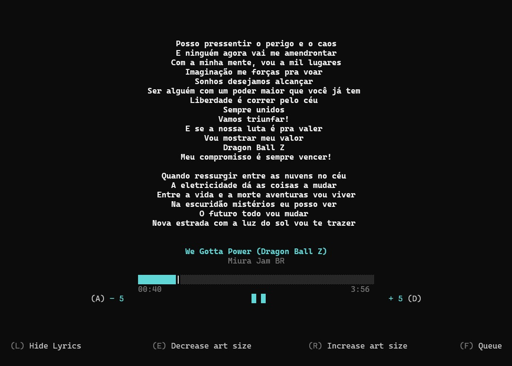

<h1 align="center">🎶 TGPSound: Console YouTube Client</h1>
<p align="center">A lightweight YouTube console client built with C# and .NET</i>

<p align="center">
  
  
  
  
  
  
  
</p>

<table>
  <tr>
    <td></td>
    <td></td>
  </tr>
  <tr>
    <td></td>
    <td></td>
  </tr>
</table>

<p align="center">
	<i>MainPage • Audio player • Lyrics View</i>
</p>

## 🚀 About

TGPSound is a console-based YouTube client that allows you to search, extract and play audio streams directly from the terminal,
without the need for a web browser. It leverages reverse engineering techniques to interact with YouTube's internal APIs, providing a fast and efficient way to access audio content.

This project was built for learning purposes, focusing on:
- Reverse engineering
- HTTP requests and API behavior
- Stream extraction
- Clean and efficient console architecture
- Audio playback integration
- Advanced console UI with Spectre.Console
- Handling YouTube's dynamic content and anti-scraping measures

## ✨ Features

- 🔍 Search musics
- 🔍 View lyrics in player screen
- 🎵 Extract better audio streams
- ⚡ Fast and lightweight
- 🧠 Reverse engineered endpoints
- 💻 Fully console-based

## 🧠 Tech Stack

- C# / .NET
- HttpClient
- JSON Parsing
- Reverse Engineering techniques

## 🚀 Goals

- [x] Audio search system
- [x] Audio stream extraction
- [x] HTTP requests with custom headers
- [x] Reverse engineered endpoints (Thanks YouTubeExplode)
- [x] Console-based interface
- [x] Fast and lightweight architecture
- [x] Advanced console UI (Spectre.Console)
- [x] Player lyrics and metadata display (in 24/04/2026)
- [ ] Metadata enrichment (thumbnails, channel info)
- [ ] Detailed video information (views, likes, etc)
- [ ] Refactor code structure (services, separation)
- [ ] Better error handling (expired streams, failures)
- [ ] Playlist support
- [ ] Audio download system
- [ ] Search improvements (ranking, filtering)
- [ ] Local cache system
- [ ] Multi-threaded downloads

## 📚 Libraries

- **Spectre.Console** — rich console UI and formatting
- **Spectre.Console.ImageSharp** — image rendering in console
- **YouTubeExplode** — reverse engineered YouTube endpoints
- **LibVLC** — audio playback engine
- **LibVLCSharp** — C# bindings for LibVLC

## 📦 Installation

```bash
git clone https://github.com/MatheusTGP/TGPSound.git
cd TGPSound
dotnet run
```

## ⚠️ Disclaimer

This project is not affiliated with, authorized, maintained, sponsored or endorsed by YouTube or Google.

TGPSound is an independent educational project created for learning purposes, focusing on reverse engineering, networking and media streaming concepts.

All content is provided by third-party services. This project does not host, store or distribute any media.

Users are responsible for complying with applicable laws and the terms of service of the platforms they interact with.
